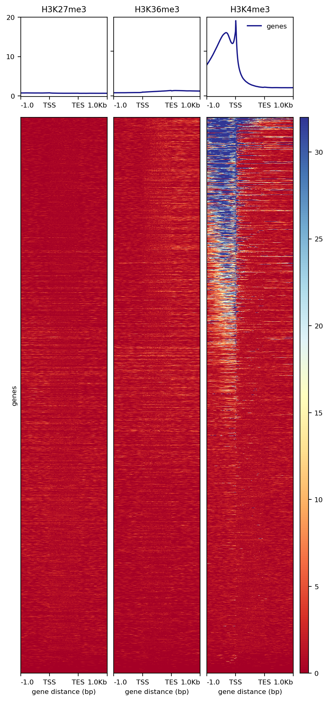

```{r setup, include=FALSE}
knitr::opts_chunk$set(echo = TRUE)
```

# Heatmap plots

## Human data

### Comparing the signal

We will visualize the distribution of epigenetic marks throughout the human genome, especially in trimethylation at lysine 36 of histone H3 (H3K36me3), generally associated with transcription elongation and regions of active euchromatin.

To do this we will run the following commands:

plotHeatmap -m matrix_H3K36me3_matrix.tab.gz -out H3K36me3_genes.png \--heatmapHeight 15 \--refPointLabel gene.center \--regionsLabel genes \--plotTitle ' H3K36me3 signal'

```         
module load deeptools/2.5.3

computeMatrix reference-point -S /mnt/atgc-d1/bioinfoII/data/deepTools/H3K36me3.bw -R /mnt/atgc-d1/bioinfoII/data/deepTools/Human38_genesGencodev39.bed --referencePoint center -a 2000 -b 2000 -out matrix_H3K36me3_matrix.tab.gz
```

Where:

`-S H3K36me3.bw`: Specifies the BigWig (.bw) file with the ChIP-seq signals for the H3K36me3 tag.

`-R Human38_genesGencodev39.bed`: Defines the regions of interest using a BED file with gene annotations of the human genome (GRCh38) based on Gencode v39.

`--referencePoint center`: Uses the center of each region (e.g. the center of the genes) as a reference point to align the signals.

`-a 2000` `-b 2000`: Adds 2 kb of upstream region (-b) and 2 kb of downstream region (-a) with respect to the reference point. This allows to observe the distribution of the epigenetic mark in the vicinity of the gene center.

`-out matrix_H3K36me3_matrix.tab.gz`: Generates a compressed matrix (.gz) with the H3K36me3 signal values in the specified regions.

Then to generate the graph we use the following command:

```         
plotHeatmap -m matrix_H3K36me3_matrix.tab.gz -out H3K36me3_genes.png --heatmapHeight 15 --refPointLabel gene.center --regionsLabel genes --plotTitle ' H3K36me3 signal'
```

Where:

`-m matrix_H3K36me3_matrix.tab.gz`: Uses the previously generated matrix as input.

`-out H3K36me3_genes.png`: Creates a heatmap image (.png) with the H3K36me3 signal.

`--heatmapHeight 15`: Adjusts the height of the heatmap to 15 units, useful for a better visualization of many regions.

`--refPointLabel gene.center`: Label the reference point in the heatmap as "gene center".

`--regionsLabel genes`: Assigns the label "genes" to the analyzed regions.

`--plotTitle 'H3K36me3 signal'`: Sets the title of the plot.

Finally we obtain the following heatmap plot, loading our local repository by the next command:

```         
scp palbarran@dna.lavis.unam.mx:/mnt/atgc-/mnt/atgc-d1/bioinfoII/palbarran/Visualizacion_2/mouse/H3K36me3_genes.png .
```

{width="231"}

Biological Interpretation:

-   Accumulation of H3K36me3 in Central Regions:

    The line profile indicates that H3K36me3 signal increases toward the center of genes, consistent with its role in transcription elongation. This mark is usually associated with active gene bodies, especially in actively transcribing genes.[1]

-   Homogeneous Pattern in the Heat Map:

    The heat map shows a relatively uniform distribution, with no sharply defined peaks in the tag signal.

    -   This could indicate that H3K36me3 is widely distributed in gene bodies rather than being localized to specific regions.

    -   The fact that many phyla (genes) show a similar pattern suggests that this could be a widespread mechanism in the human genome for regulating gene transcription. [1]

### Comparing multiple signals in one plot.

We now perform a comparative heatmap of the epigenetic marks, H3K27me3, H3K36me3 and H3K4me3 along the gene regions of the human genome.

First we copy the following files from the `/mnt/atgc-d1/bioinfoII/data/deepTools` folder to the folder where we will run the graph. With the following similar command line for the other files.

The files are:

`H3K27me3.bw`, `H3K36me3.bw`, `H3K4me3.bw` and `Human38_genesGencodev39.bed`

```         
cp /mnt/atgc-d1/bioinfoII/data/deepTools/H3K27me3.bw .
```

Then we run the following command to make the matrix

```         
computeMatrix scale-regions -S H3K27me3.bw H3K36me3.bw
H3K4me3.bw -R Human38_genesGencodev39.bed -- beforeRegionStartLength 1000 --regionBodyLength 1000 -- afterRegionStartLength 1000 --skipZeros -o matrix.mat.gz
```

Where:

`scale-regions` : allows alignment and scaling of regions of interest (e.g., genes) for uniform signal comparison.

`-S H3K27me3.bw H3K36me3.bw H3K4me3.bw`:\
Specifies the BigWig (.bw) files containing the histone tag signals.

`-R Human38_genesGencodev39.bed`:\
Provides a BED file with the genomic regions of interest.

`--beforeRegionStartLength 1000`:\
Defines the extent of the upstream window (to the left) with respect to the TSS (Transcription Start Site) of the gene.

`--regionBodyLength 1000`:\
Sets the length to which the body of each gene should be scaled.

`--afterRegionStartLength 1000`:\
Defines the extension of the downstream window (to the right) with respect to the TES (Transcription End Site) of the gene.

`--skipZeros`:\
This option omits regions with no coverage or zero signal values.

`-o matrix.mat.gz`:\
Specifies the output file in compressed format (.gz).

Then we generate a heatmap from the data matrix created previously with computeMatrix

```         
plotHeatmap -m matrix.mat.gz -out Heatmap_Multiple_signals.png
```

Where:

`-m matrix.mat.gz`:\
Defines the input matrix generated with computeMatrix.

`-out Heatmap_Multiple_signals.png`:\
Specifies the output file name for the heatmap in image format (PNG).

We generate the following graph:

{width="351"}

Signals are visualized in a window of 1 kb before the start of the gene (TSS), along the gene body (1 kb) and up to 1 kb after the end of the gene (TES).

-   Signal profiling (top plots): H3K4me3 shows a clear enrichment around the TSS, consistent with its role as an active promoter marker. In contrast, H3K27me3 and H3K36me3 show much lower signals, which could indicate a lower association of these marks in the promoter regions under the conditions analyzed.[2]

-   Heatmaps (lower graphs):

    -   H3K27me3: A homogeneous and low distribution is shown across gene regions, which is expected for this tag typically associated with transcriptional repression in broader regions, such as facultative heterochromatin.

    -   H3K36me3: The signal is low but exhibits a slight increase along the gene body, consistent with its role in transcription elongation and its enrichment in actively transcribed regions.

    -   H3K4me3: Heatmap shows a strong enrichment in the TSS, with a decreasing gradient towards the gene body. This reinforces its role in transcriptional activation and chromatin accessibility at promoters. [2][3]

## Mouse data

We download the mouse gene information in bed format, in the UCSC browser, in the [next link](https://genome.ucsc.edu/cgi-bin/hgTables) ; where we put the following options to obtain the file in .bed format:


Then, we load the bed file into the cluster, with the next command.

```         
scp /home/pgodoy/Documents/Bioinfo/Visualizacion_2/MouseGenes_GENCODE.bed palbarran@dna.lavis.unam.mx:/mnt/atgc-d1/bioinfoII/palbarran/Visualizacion_2/human/
```

With this we can generate the heatmap graph to observe the intensity of the ChIP-seq readings in the regions defined by the BED file we previously downloaded.

With the following commands:

```         
module load deeptools/2.5.3

computeMatrix reference-point -S /mnt/atgc-d1/bioinfoII/palbarran/Alineacion/alignment_mouse/Mouse_aligned_reads_ordenado.bw -R /mnt/atgc-d1/bioinfoII/palbarran/Visualizacion_2/human/MouseGenes_GENCODE.bed --referencePoint center -a 2000 -b 2000 -out matrix_Mouse_ChIPseq.tab.gz

plotHeatmap -m matrix_Mouse_ChIPseq.tab.gz -out Mouse_ChIPseq_heatmap.png --heatmapHeight 15 --refPointLabel gene.center --regionsLabel genes --plotTitle 'Mouse ChIP-seq signal'
```

The options were the same as those used previously when generating the heatmap for human data.

Two plots were made, one with the raw data before alignment and the other with the trimming-cleaned data. Differences were observed in the intensity of the signal showing the heatmaps. The plots are as follows.

```{r, fig.show='hold', out.width='35%',out.height='800px'}
library(knitr)
include_graphics(c("mouse_heatmap.png","Mouse_ChIPseq_heatmap.png"))
```

The comparative plots show the ChIP-seq signal profiles around the gene center. The left graph represents the data without trimming, while the right graph shows the data after trimming.

-   Signal profile (top plot):

    -   Both plots show peaks in the signal, indicating regions of enrichment around the center of the genes.

    -   The signal is higher in the trimmed sample (maximum near 15) compared to the untrimmed sample (maximum near 10).

    -   This suggests that trimming improves the quality of the reads by removing adapters and low-quality sequences, allowing for better alignment and thus a clearer and more defined signal.

-   Heatmap (bottom graph):

    -   In the sample without trimming (left), the heatmap shows a more heterogeneous signal distribution with a lower range of values (0 to 14).

    -   In contrast, in the trimmed sample (right), the signal is predominantly red, with a much larger range (0 to 1,200,000). This extreme difference could indicate an oversaturation of the signal or a problem in the normalization of the data.

    -   It is possible that trimming has increased the quality of the readings, but the color scale may not be correctly adjusted, resulting in a less informative display.

# Drought Conditions in the US

The data comes from the [National Integrated Drought Information System](https://www.drought.gov/).

The Standardized Precipitation Index (SPI) is an index to characterize meteorological drought on a range of timescales, ranging from 1 to 72 months, for the lower 48 U.S. states. The SPI is the number of standard deviations that observed cumulative precipitation deviates from the climatological average. NOAA's National Centers for Environmental Information produce the 9-month SPI values below on a monthly basis, going back to 1895.

```{r, message=FALSE}
#Library
library(tidyverse)
library(lubridate)
library(ggplot2)
library(ggplot2)
library(viridis)
library(usmap)

#Loading our data
tuesdata = tidytuesdayR::tt_load(2022, week = 24)
data = tuesdata$drought

# Date convert and data process
data <- data %>%
  mutate(
    date = ymd(gsub("d_", "", DATE)),
    year = year(date),
    month = month(date, label = TRUE, abbr = TRUE)
  )
```

**Selected problem:** Analysis of drought severity in the U.S. over time.

**Objective:**

To visualize how drought severity has evolved in different U.S. states and to determine if there are specific trends, such as an increase in the frequency or severity of extreme droughts.

## Evolution of the area affected by drought in the U.S.

This graph shows the temporal evolution of the percentage of area affected by different levels of drought in the United States. Drought levels range from D0 (abnormally dry drought) to D4 (exceptional drought).

```{r}
# 1. Serie temporal: Superficie afectada por categoría de sequía
drought_long <- data %>%
  pivot_longer(cols = D0:D4, names_to = "drought_level", values_to = "area_pct")

ggplot(drought_long, aes(x = date, y = area_pct, fill = drought_level)) +
  geom_area(alpha = 0.7) +
  scale_fill_viridis_d() +
  labs(title = "Evolución de la superficie afectada por sequías en EE. UU.",
       x = "Fecha", y = "% de área afectada") +
  theme_minimal()
```

The temporal series graph illustrates the evolution of drought-affected areas in the U.S. over time. It highlights periods of increased drought severity and helps identify trends in drought conditions.

## Severity of extreme drought (D4) by state

This graph represents the severity of extreme drought (D4) in each U.S. state.

```{r, warning=FALSE}
# 2. Mapa coroplético: Severidad de la sequía por estado
drought_state <- data %>%
  group_by(state) %>%
  summarise(avg_drought = mean(D4, na.rm = TRUE))

plot_usmap(data = drought_state, values = "avg_drought", regions = "states") +
  scale_fill_viridis_c(name = "% Sequía Extrema (D4)", option = "magma") +
  labs(title = "Severidad de la sequía extrema (D4) por estado") +
  theme(legend.position = "right")
```

The choropleth map shows the severity of extreme drought (D4) across different states. States with higher values are more severely affected, indicating regions that may require targeted drought mitigation strategies.

## Distribution of drought categories by state

This stacked bar chart shows the distribution of the different drought categories (D0 to D4) in each state.

```{r}
# 3. Gráfico de barras apiladas: Comparación de categorías de sequía por estado
ggplot(drought_long, aes(x = state, y = area_pct, fill = drought_level)) +
  geom_bar(stat = "identity", position = "fill") +
  scale_fill_viridis_d() +
  labs(title = "Distribución de las categorías de sequía por estado",
       x = "Estado", y = "Proporción") +
  theme_minimal() +
  coord_flip()
```

The stacked bar chart provides a comparative view of drought categories across states. It helps identify states with higher proportions of severe and extreme drought conditions, offering insights into regional drought vulnerabilities.

## Conclusion

The analysis of drought conditions in the U.S. reveals significant variations in drought severity across different states and over time. The temporal series indicates periods of increased drought severity, while the choropleth map and stacked bar chart highlight states most affected by extreme drought conditions. These visualizations underscore the importance of continuous monitoring and targeted interventions to mitigate the impacts of drought in vulnerable regions.

# References

[1] Wagner, E., Carpenter, P. Understanding the language of Lys36 methylation at histone H3. *Nat Rev Mol Cell Biol* **13**, 115--126 (2012). <https://doi.org/10.1038/nrm3274>

[2] Barski, A., Cuddapah, S., Cui, K., Roh, T., Schones, D. E., Wang, Z., Wei, G., Chepelev, I., & Zhao, K. (2007). High-Resolution Profiling of Histone Methylations in the Human Genome. *Cell*, *129*(4), 823-837. <https://doi.org/10.1016/j.cell.2007.05.009>

[3] Zhou, V., Goren, A. & Bernstein, B. Charting histone modifications and the functional organization of mammalian genomes. *Nat Rev Genet* **12**, 7--18 (2011). <https://doi.org/10.1038/nrg2905>
